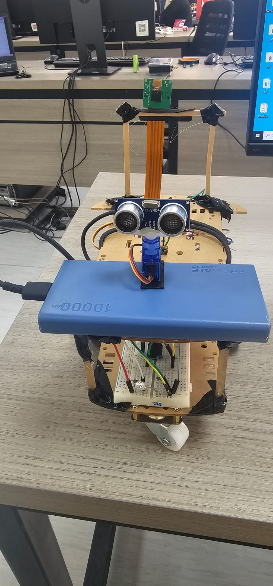
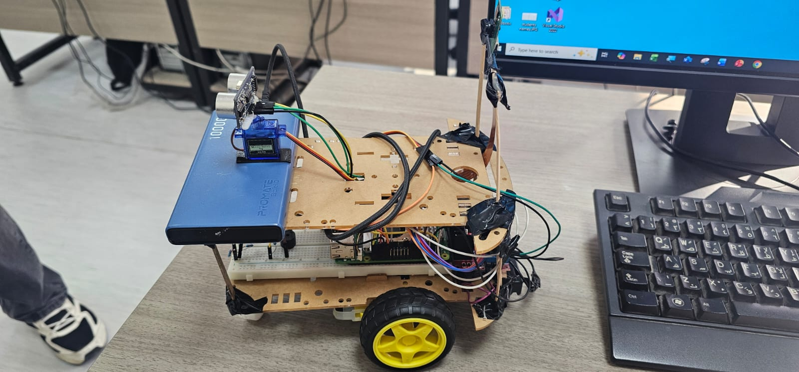
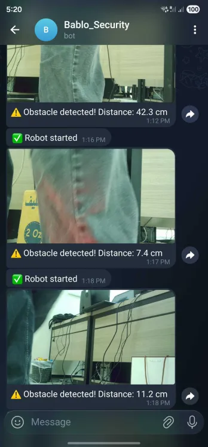
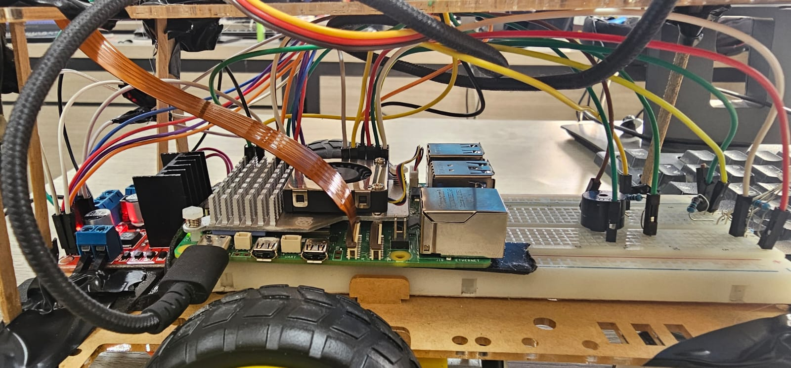

# WALL-E: Autonomous Surveillance Robot

An autonomous obstacle-avoiding surveillance robot built on a Raspberry Pi 5. It scans its environment with an ultrasonic sensor on a servo, navigates around obstacles in real time, and sends photo alerts over Telegram whenever something enters its critical zone.

---

## Demo

| | |
|---|---|
|  |  |
|  |  |

Demo videos are in the [`videos/`](videos/) folder.

---

## Features

- **Real-time obstacle avoidance** using an HC-SR04 ultrasonic sensor mounted on a servo for ±90° scanning.
- **Median-filtered distance readings** (5 samples) to reject noise spikes from reflections.
- **Three-zone speed control** — cruise (≥145 cm), slow (65–145 cm), stop & avoid (<65 cm).
- **Pulse-based PWM motor control** for smooth low-speed motion and precise turning.
- **Telegram alerts with photos** captured by the Pi Camera the moment an obstacle enters the critical zone.
- **RGB LED status indicator** (green = clear, yellow = slow, red = obstacle) and **buzzer** for audio alerts.
- **Cooldown mechanism** (8 s for messages, 2 s for photos) so alerts don't spam the chat.
- **Stuck detection** that escalates avoidance behavior — longer turn bursts when the robot has stopped repeatedly.
- **Safe shutdown** on Ctrl+C — motors stop, servo centers, LEDs and buzzer turn off, "Robot stopped" sent to Telegram.

---

## Hardware

| Component | Purpose |
|---|---|
| Raspberry Pi 5 | Main controller, runs all logic in Python |
| HC-SR04 ultrasonic sensor | Distance measurement |
| SG90 servo motor | Rotates the ultrasonic sensor for environment scanning |
| 2× DC motors + L298N driver | Differential drive |
| Raspberry Pi Camera Module | Captures photos of detected obstacles |
| RGB LED | Visual status (green/yellow/red) |
| Buzzer | Audio alert |
| 3× 18650 Li-ion cells | Power supply |
| Wooden chassis + caster wheel | Mechanical structure |

### GPIO Pin Map (BCM)

| Pin | Component |
|---|---|
| 2  | HC-SR04 trigger |
| 6  | HC-SR04 echo |
| 12 | Servo (PWM) |
| 13 | L298N ENB (right motor PWM) |
| 16 | RGB LED — red |
| 17 | L298N IN3 |
| 18 | Buzzer |
| 19 | L298N ENA (left motor PWM) |
| 20 | RGB LED — green |
| 21 | RGB LED — blue |
| 22 | L298N IN4 |
| 23 | L298N IN1 |
| 24 | L298N IN2 |

---

## Software Stack

- **Language:** Python 3
- **Libraries:** [`gpiozero`](https://gpiozero.readthedocs.io/) for GPIO/PWM, `urllib` (stdlib) for Telegram API, `subprocess` calling `rpicam-still` for photo capture
- **Platform:** Raspberry Pi OS (Bookworm or later, for `rpicam-still`)
- **Single-file design** — everything lives in `main.py`

---

## How It Works

The main loop runs continuously after a one-time hardware init:

1. **Center the servo** and take a 5-sample median-filtered distance reading from the front.
2. **Pick a behavior based on the reading:**
   - `≥ 145 cm` → cruise forward at 50% speed, LED green.
   - `65–145 cm` → slow forward at 32% speed, LED yellow.
   - `< 65 cm` → trigger obstacle response.
3. **Obstacle response:** stop, set LED red, beep, take a photo, send Telegram alert with the photo (or text if camera unavailable), then enter avoidance.
4. **Avoidance:** sweep the servo from −90° to +90° and back, picking the angle with the largest distance. Pulse-turn toward that angle in short bursts, re-checking front clearance after each burst until clear (>90 cm) or the burst limit is hit. Then side-step forward briefly.
5. **Repeat.**

If the robot keeps hitting obstacles (stuck counter ≥ 6), avoidance bursts get longer and more numerous to break out of corner traps.

See [`docs/flowchart.png`](docs/flowchart.png) for the full control flow.

---

## Repository Structure

```
.
├── README.md
├── main.py                   # the entire robot program
├── docs/
│   ├── WALL-E_Report.pdf     # technical report
│   ├── presentation.pptx     # slide deck
│   └── flowchart.png
├── images/                   # robot photos and screenshots
└── videos/                   # demo recordings
```

---

## Setup

1. **Flash Raspberry Pi OS** to your Pi 5 and enable the camera + GPIO interfaces in `raspi-config`.
2. **Install dependencies:**
   ```bash
   sudo apt update
   sudo apt install python3-gpiozero rpicam-apps
   ```
   (`urllib`, `subprocess`, and friends are in the stdlib — no `pip install` needed.)
3. **Create a Telegram bot** via [@BotFather](https://t.me/BotFather), grab the bot token, and find your chat ID (e.g. by messaging the bot and visiting `https://api.telegram.org/bot<TOKEN>/getUpdates`).
4. **Wire the hardware** according to the GPIO pin map above.
5. **Export the bot credentials and run:**
   ```bash
   export TG_BOT_TOKEN="123456:ABC-your-token-here"
   export TG_CHAT_ID="123456789"
   python3 main.py
   ```
   Press Ctrl+C to stop safely.

If the env vars aren't set, the robot still runs — it just skips the Telegram calls.

---

## Tuning Parameters

These live at the top of `main.py` and were chosen by trial during real-world testing:

| Constant | Value | Meaning |
|---|---|---|
| `FAR_CM` | 145 | Above this → cruise speed |
| `OBSTACLE_CM` | 65 | Below this → stop and start avoidance |
| `CLEAR_CM` | 90 | Threshold to consider front "clear again" after a turn |
| `CRUISE_SPEED` | 0.50 | PWM duty for cruising |
| `SLOW_SPEED` | 0.32 | PWM duty for slow zone and side-step |
| `TURN_SPEED` | 0.42 | PWM duty for turn bursts |
| `SCAN_STEP` | 12° | Servo angular step during scan |
| `TURN_BURST` | 0.16 s | Duration of each turn pulse |
| `MAX_TURN_BURSTS` | 14 | Hard cap on consecutive turn pulses |
| `TG_COOLDOWN` | 8.0 s | Minimum interval between Telegram messages |
| `PHOTO_COOLDOWN` | 2.0 s | Minimum interval between camera shots |
| `STUCK_COUNT_LIMIT` | 6 | When exceeded, avoidance gets stronger |

---

## Testing & Results

Tested indoors on flat surfaces with obstacles between 20–200 cm, with both stationary and moving targets:

- Median filtering eliminated almost all spurious distance spikes.
- The robot consistently picked the direction with the largest clearance after scanning.
- Telegram alerts arrived within ~1–2 seconds; cooldowns prevented spam.
- Pulse-based PWM noticeably improved low-speed turning vs. continuous drive.
- No crashes during extended runs; clean shutdown on Ctrl+C in every test.

Full test details are in the [report](docs/WALL-E_Report.pdf).

## Future Enhancements

- Offload low-level sensor/motor I/O to an Arduino over serial, freeing the Pi for vision tasks.
- Add an IMU for tilt correction and heading estimation.
- Replace the HC-SR04 + servo with an RPLIDAR for full 360° scanning.
- Run YOLOv5-tiny on the Pi for real-time obstacle classification.
- Migrate to ROS 2 nodes (sensing, motion, vision, comms).
- Add battery monitoring and a higher-capacity power pack.

---

## License

Released for educational purposes. Feel free to learn from and adapt it.
